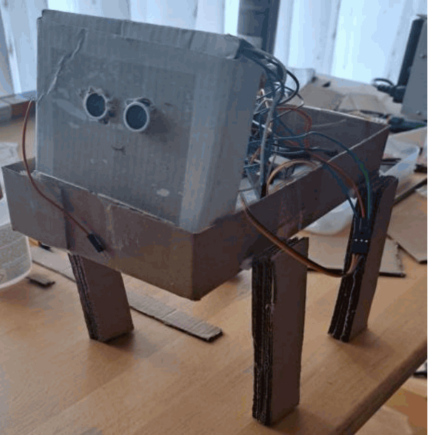
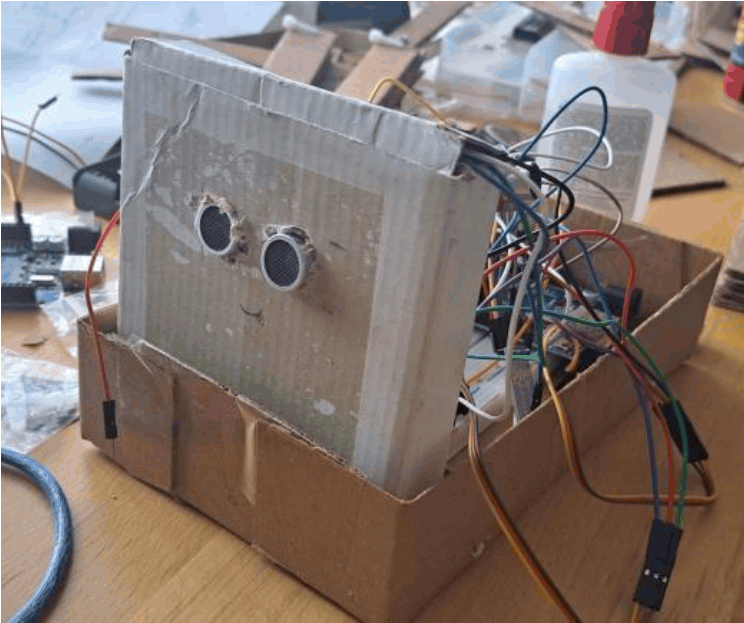
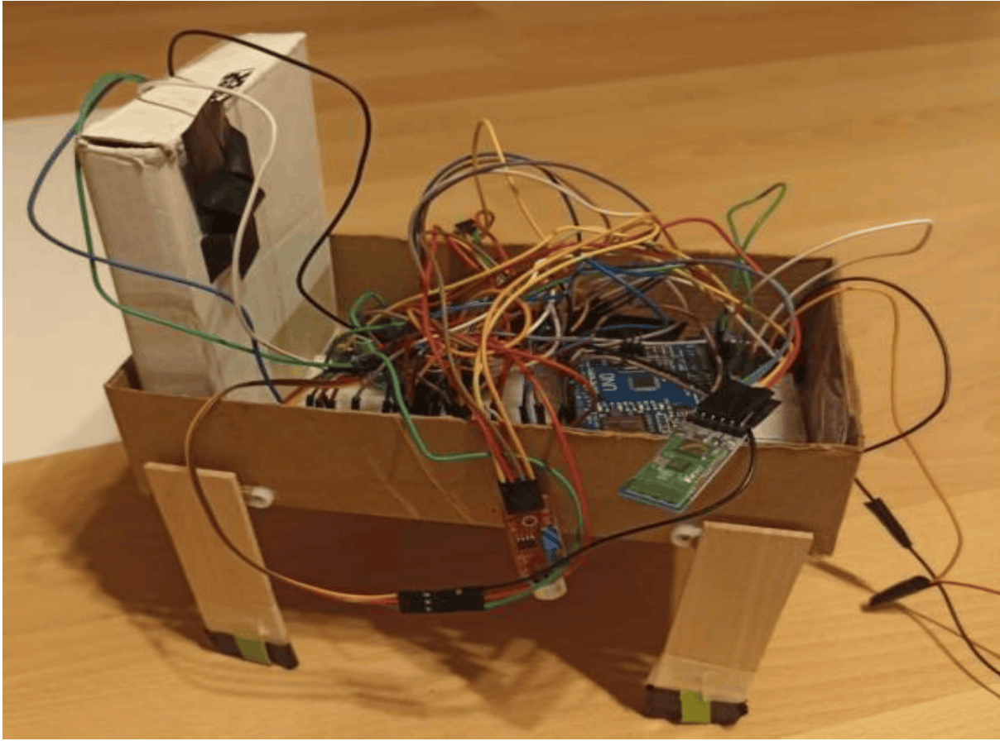
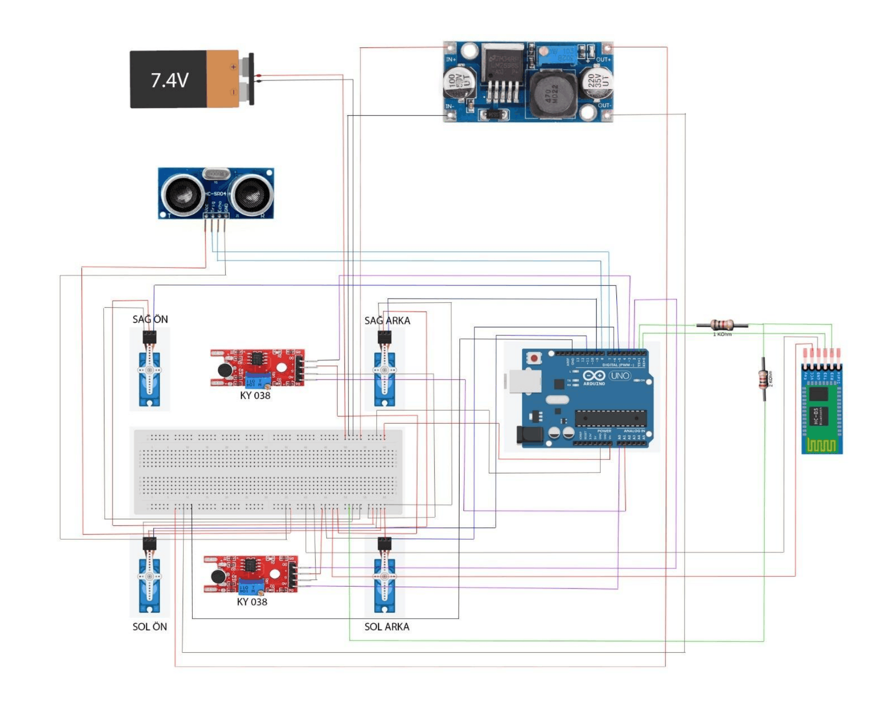

# 🐕 RoboDog — Arduino Tabanlı Dört Ayaklı Robot Köpek

**RoboDog**, Arduino Uno R3 tabanlı, ses (alkış) komutlarıyla, Bluetooth üzerinden mobil cihazla ve ultrasonik sensör yardımıyla otonom olarak hareket edebilen dört ayaklı bir robot köpek projesidir.

Sistemde `delay()` kullanılmamış olup; donanımsal zamanlayıcı (`Timer2`), dış kesmeler (`INT0`, `INT1`) ve `millis()` tabanlı asenkron yapı sayesinde yürüme, çevre kontrolü ve haberleşme işlemleri eş zamanlı yürütülür.

---

## Çalışma Videosu

https://github.com/user-attachments/assets/4d8757bc-053e-45c3-a4d5-d1aea47ff42e

https://github.com/user-attachments/assets/5c6d7b54-5b31-4e66-855d-20e87a25e1af

https://github.com/user-attachments/assets/ec1229c3-4e2d-439b-b491-f1fefab2c523

---

## Proje Görselleri

  
  
  

---

## Kullanılan Malzemeler

| Malzeme | Adet | Görevi |
| :--- | :---: | :--- |
| **Arduino Uno R3** | 1 | ATmega328P tabanlı ana kontrol kartı |
| **SG90 Mini Servo Motor** | 4 | Ön ve arka bacakların hareket kontrolü (90 derece nötr duruş) |
| **FC-04 / KY-038 Ses Sensörü** | 2 | Sağ ve sol yönlü alkış seslerini dış kesme (Interrupt) ile algılama |
| **HC-05 Bluetooth Modülü** | 1 | Telefondan kablosuz hareket komutlarını (`F`, `B`, `S`, `X`, `T`) alma |
| **HC-SR04 Ultrasonik Sensör** | 1 | Otonom engel algılama ve mesafe ölçümü |
| **LM2596 Voltaj Regülatörü** | 1 | 7.4V pil gerilimini servolar için sabit 5V seviyesine düşürme |

---

## Devre Şeması ve Pin Bağlantıları

### Pin Tablosu

| Donanım Bileşeni | Kod Değişkeni | Arduino Pini | Yön / Mod | Açıklama |
| :--- | :--- | :--- | :--- | :--- |
| **Sol Ses Sensörü** | `soundPin1` | `D2` (`INT0`) | `INPUT` | Sol alkış algılama (`RISING` dış kesme) |
| **Sağ Ses Sensörü** | `soundPin2` | `D3` (`INT1`) | `INPUT` | Sağ alkış algılama (`RISING` dış kesme) |
| **HC-SR04 Trig** | `trigPin` | `D7` | `OUTPUT` | Ultrasonik tetikleme pini |
| **HC-SR04 Echo** | `echoPin` | `D8` | `INPUT` | Ultrasonik yankı ölçüm pini |
| **Servo – Ön Sol** | `onSol` | `D11` | `PWM OUTPUT` | Ön sol bacak kontrolü |
| **Servo – Ön Sağ** | `onSag` | `D5` | `PWM OUTPUT` | Ön sağ bacak kontrolü |
| **Servo – Arka Sol** | `arkaSol` | `D6` | `PWM OUTPUT` | Arka sol bacak kontrolü |
| **Servo – Arka Sağ** | `arkaSag` | `D9` | `PWM OUTPUT` | Arka sağ bacak kontrolü |
| **HC-05 Bluetooth** | `Serial` | `D0 (RX)` / `D1 (TX)` | `UART` | Seri port haberleşmesi (9600 baud) |
| **LM2596 Regülatör** | - | `5V` / `GND` | `POWER` | Servolar için sabit 5V besleme hattı |

> **Not:** Devrede Arduino `D1 (TX)` pininden çıkan 5V sinyali HC-05'in 3.3V `RX` pinine güvenli şekilde iletmek için 1k Ohm ve 2k Ohm dirençlerle gerilim bölücü kullanılmıştır. Arduino'ya USB ile kod yüklerken `D0` ve `D1` bağlantıları çıkarılmalıdır.

---

## Çalışma Prensibi

### 1. Kesme (Interrupt) ve Zamanlayıcı (Timer) Yapısı
* **Timer2 Kesmesi (`ISR(TIMER2_COMPA_vect)`):** CTC modunda 1 ms periyotla çalışır (`OCR2A = 249`, Prescaler = 64). Her 100 ms'de bir `tick100ms` bayrağını tetikleyerek sistemi kilitlemeden mesafe ölçümü yaptırır.
* **Dış Kesmeler (`INT0` & `INT1`):** `D2` ve `D3` pinlerine bağlı ses sensörleri alkış sesini anlık yakalar. Gürültüden etkilenmemesi için 300 ms debounce süresi ve 1500 ms alkış bekleme penceresi bulunur.
* **`millis()` Döngüsü:** Bacakların 4 adımlı yürüme hareketi (`moveInterval = 500 ms`) işlemciyi bekletmeden yürütülür.

### 2. Otonom Engel Sakınma (`akilliKararMekanizmasi()`)
HC-SR04 sensörü ile her 100 ms'de bir yapılan ölçüm sonucuna göre:
* **15 cm'den yakın engel:** Robot ileri (`FORWARD`) yürüyorsa çarpmamak için otomatik durur (`IDLE`) ve bacaklarını nötr konuma alır.
* **8 cm'den yakın engel:** Robot hangi modda olursa olsun anında oturma (`SIT`) pozisyonuna geçer.
* **20 cm'den uzak (engel kalktığında):** Robot engel yüzünden oturuyorsa, engel çekildiğinde otomatik olarak tekrar ayağa kalkar (`IDLE`).

### 3. Komutlar ve Hareketler

#### Alkış Komutları
| Sensör | Alkış Sayısı | Aksiyon | Servo Açıları |
| :--- | :---: | :--- | :--- |
| **Sağ Sensör (`D3`)** | 2 Alkış | Sağ ön patiyi kaldırır | `onSag: 135` (1 sn sonra 90 derece) |
| **Sol Sensör (`D2`)** | 3 Alkış | Sol ön patiyi kaldırır | `onSol: 45` (1 sn sonra 90 derece) |
| **Sol Sensör (`D2`)** | 4+ Alkış | Oturma pozisyonuna geçer | `arkaSol: 60`, `arkaSag: 120` |

#### Bluetooth Komutları (9600 Baud)
| Komut | Durum | Açıklama |
| :---: | :--- | :--- |
| `F` | `FORWARD` | 4 adımlı ileri yürüme hareketini başlatır (60 ve 120 derece adımlarla) |
| `B` | `BACKWARD` | 4 adımlı geri yürüme hareketini başlatır |
| `S` / `X` | `IDLE` | Robotu durdurur ve tüm bacakları 90 derece dik konuma (`resetPosture()`) getirir |
| `T` | `SIT` | Ön bacakları 90 derece sabit tutup arka bacakları kırarak (`60` / `120`) oturtur |

---

## Yazılım Fonksiyonları

| Fonksiyon | Görevi |
| :--- | :--- |
| `setup()` | Seri haberleşmeyi, pin modlarını, servo bağlantılarını, dış kesmeleri ve `Timer2` ayarlarını başlatır. |
| `loop()` | Bluetooth komutlarını okur, `tick100ms` bayrağını denetler, yürüme ve alkış fonksiyonlarını çalıştırır. |
| `processCommand(char cmd)` | Gelen `F`, `B`, `S`, `X`, `T` karakterlerine göre `currentState` durumunu değiştirir. |
| `updateMovement()` | `millis()` kullanarak bacak servolarını sırayla sürer ve yürüme hareketini oluşturur. |
| `akilliKararMekanizmasi()` | Mesafe verisine göre durma, oturma ve engel kalktığında ayağa kalkma kararlarını uygular. |
| `mesafeOlc()` | HC-SR04 ile mesafeyi ölçer ve santimetreye çevirir (30 ms timeout korumalı). |
| `ISR(TIMER2_COMPA_vect)` | Her 1 ms'de tetiklenen donanım kesmesidir; 100 ms'de bir çevre kontrol bayrağını açar. |
| `clapISR1()` / `clapISR2()` | Sol ve sağ ses sensörlerinden gelen sinyalleri 300 ms debounce ile sayar. |
| `checkClapEvaluation()` | Alkış sayısına göre pati kaldırma veya oturma hareketini tetikler. |
| `sitPosture()` / `resetPosture()` | Robotu oturma pozisyonuna veya 90 derece dik duruş konumuna getirir. | 
